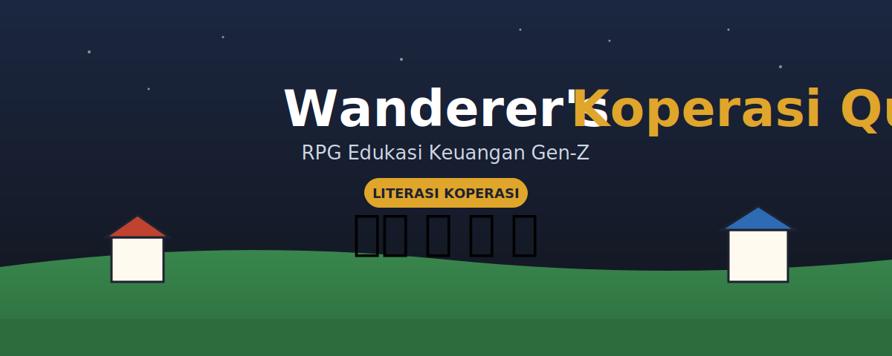

<div align="center">



# 🎮 Wanderer's Koperasi Quest

**RPG Edukasi Keuangan** yang mengajarkan konsep koperasi Indonesia lewat petualangan.

[](#)
[](https://phaser.io)
[](#)

Belajar koperasi sambil bermain, tanpa install, langsung di browser.

</div>

---

## ✨ Tentang

Banyak anak muda menganggap koperasi kuno dan tidak relevan. Edukasi konvensional
seperti seminar dan buku panduan gagal menarik perhatian mereka. **Wanderer's
Koperasi Quest** mengubah materi ekonomi yang berat menjadi *RPG naratif* berbasis
browser yang bisa langsung dimainkan siapa saja, tanpa install, dengan ritme
masing-masing.

Pemain berperan sebagai **Wanderer** (pengembara) yang membantu sebuah desa
bangkit melalui koperasi, sambil **mengalami langsung** siklus koperasi yang utuh.

## 🎯 Konsep koperasi yang diajarkan

| Tahap di game | Konsep |
|---|---|
| Daftar ke Kepala Desa | Apa itu koperasi (dari, oleh, untuk anggota) |
| Bayar di Kantor Koperasi | **Simpanan Pokok** & **Simpanan Wajib** |
| Pinjam ke Bendahara | **Pinjaman modal** anggota (koperasi vs rentenir) |
| Tani di Ladang lalu jual di Pasar | Usaha produktif & arus kas |
| Lunasi pinjaman | Tanggung jawab anggota |
| Hadiri **RAT** di Balai Desa | **Rapat Anggota Tahunan** & pembagian **SHU** |

## ▶️ Cara bermain

**Kontrol:** Panah `← ↑ ↓ →` atau `W A S D` untuk bergerak, `Spasi` untuk bicara
atau beraksi. Di ponsel, gunakan tombol arah di layar. Ikuti penanda emas di peta
dan kotak misi di kanan atas.

## 🚀 Menjalankan secara lokal

Proyek memakai ES Modules, jadi jalankan lewat server (bukan `file://`):

```bash
npm install && npm run dev      # buka URL yang muncul
# atau tanpa Node:
python3 -m http.server 8123     # lalu buka http://localhost:8123
```

## ☁️ Deploy ke Vercel (direkomendasikan)

Situs ini 100% statis, jadi Vercel mengenalinya otomatis.

1. Push repo ini ke GitHub.
2. Buka [vercel.com/new](https://vercel.com/new), pilih repo **Wanderers-Koperasi**.
3. Framework Preset: **Other**, Build Command dikosongkan, Output Directory dikosongkan.
4. **Deploy.** URL publik langsung jadi, lalu cantumkan di slide demo.

Lewat CLI:

```bash
npm i -g vercel && vercel --prod
```

<details>
<summary>Alternatif: GitHub Pages</summary>

```bash
git add . && git commit -m "Wanderer's Koperasi Quest MVP"
git push -u origin main
```
Lalu **Settings, Pages, Source: `main` / root, Save**.
</details>

## 🧱 Arsitektur

```
index.html        # kerangka + memuat Phaser (CDN) & src/main.js
src/
  styles.css      # gaya tampilan
  data.js         # data dunia: peta & lokasi (tanpa logika)
  state.js        # state pemain + state machine misi  (switch/case)
  quest.js        # logika koperasi (interaksi)         (switch/case)
  quiz.js         # kuis literasi per konsep
  ui.js           # dialog, HUD, papan misi
  scene.js        # scene Phaser (render, gerak, input)
  demo.js         # mode demo otomatis
  certificate.js  # rapor & sertifikat
  main.js         # boot Phaser
docs/cover.svg    # banner
```

> **Catatan teknis (sesuai proposal):** inti permainan memakai **state machine
> `switch/case`**. Fungsi `questInfo()` menentukan misi aktif dan `interact()`
> mengevaluasi state pemain di tiap lokasi. Arsitektur ini bersih, mudah dirawat,
> dan mudah ditambah skenario baru. Lihat [`CONTRIBUTING.md`](CONTRIBUTING.md).

## 🗺️ Roadmap

- [ ] Aset visual rapi (tileset & sprite) menggantikan emoji
- [ ] Simpan progres (localStorage) & papan skor
- [ ] Event gotong royong & voting di RAT
- [ ] Mode "Pengurus": simulasi tata kelola koperasi desa

## 👥 Tim

- Ahmad Hoesin ([@zuromu](https://github.com/zuromu))
- Muhammad Idris Kamal ([@1drism](https://github.com/1drism))
- Goran Adriano Tamrella ([@adrianogoran](https://github.com/adrianogoran))

## 📄 Lisensi

Karya orisinil, All Rights Reserved. Lihat [`LICENSE`](LICENSE) untuk ketentuan lengkap.
